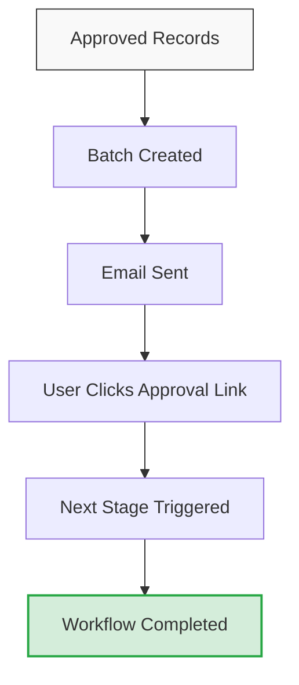
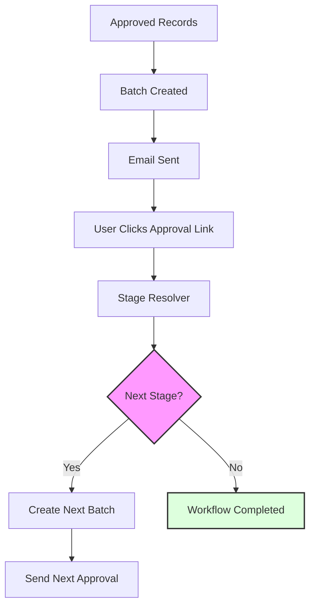
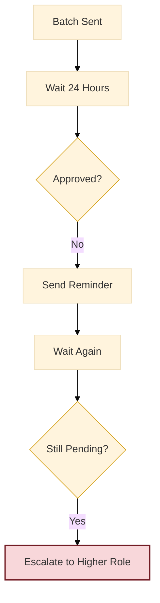
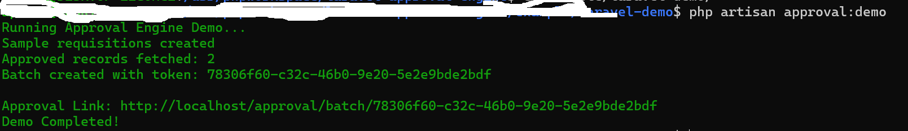
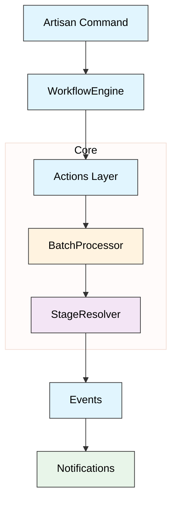

# Laravel Approval Engine

[](https://laravel.com/)
[](https://www.php.net/)
[](LICENSE)
[](https://github.com/apurba-labs/laravel-approval-engine/stargazers)

A modular, batch-based, multi-stage approval workflow engine for Laravel.
Designed for **real-world enterprise workflows** -- Supports batch approvals, email-based approval links, and configurable workflow stages.

---
## 🔥 Why This Package Exists
In most Laravel projects:
- Approval workflows are rebuilt again and again
- Logic gets tightly coupled with business models
- Email spam happens (1 record = 1 email 😓)

👉 This package solves that with a clean, scalable architecture

---

## Key Features

- **Multi-stage** approval workflows
- **Batch processing** (20 approvals → 1 email)
- **Email-based** approval links
- **Modular** workflow system (plug & play)
- **Event-driven** architecture
- **No hard dependency** on roles system
- **Clean architecture** (Engine + Actions + Support)

---

## 🧠 Example Workflows

- Requisition → HOS → COO → Completed
- Invoice → Manager → Finance → CFO
- Purchase → Supervisor → Director

---

## 🏗 How It Works


---
## 📊 Workflow Flow



---
## ⏱ Escalation & Reminder Flow




---

## 🚀 Quick Demo (2 Minutes)

```bash
git clone https://github.com/apurba-labs/laravel-approval-engine

cd laravel-approval-engine/example/laravel-demo

composer install
cp .env.example .env
php artisan key:generate

php artisan migrate
php artisan approval:demo
```
👉 Output:

```pgsql

✔ Sample data created
✔ Batch generated
✔ Approval link generated

```
## 📸 Demo Screenshot

---

## ⚙️ Installation


```bash
composer require apurba-labs/laravel-approval-engine

```

---

## 🔧 Publish Config, Migrations & Seeders

```bash
php artisan vendor:publish --tag=approval-config
php artisan migrate
php artisan db:seed --class="ApurbaLabs\ApprovalEngine\Database\Seeders\WorkflowSeeder"
php artisan db:seed --class="ApurbaLabs\ApprovalEngine\Database\Seeders\WorkflowSettingSeeder"

```

---

## 🧩 Create Workflow Module

```bash
php artisan make:workflow-module Requisition
```
### 🧠 Define Module

```php
class RequisitionModule extends BaseWorkflowModule
{
    public function model(): string
    {
        return \App\Models\Requisition::class;
    }

    public function approvedColumn(): string
    {
        return 'approved_at';
    }
    
    public function statusColumn(): string
    {
        return 'status';
    }

    public function relations(): array
    {
        return ['user'];
    }

    public function selectColumns(): array
    {
         return [
            'id',
            'user_id',
            'reference_id',
            'stage',
            'stage_status',
            'status',
            'approved_at',
        ];
    }

    public function displayColumns(): array
    {
        return [
            'reference_id' => 'Reference',
            'user.name' => 'Requested By',
        ];
    }
}


```

---

## Running Batch Processor

Run the batch processor via cron:

```
php artisan approval:send-batch
```

Example cron job:

```
* * * * * php artisan approval:send-batch
```

---

## Approval Links

Emails contain secure token-based approval links:

```
/approval/batch/{token}
```
Approvers can:

- Approve All
- Reject
- View Details

---
## 🧠 Architecture

### System Layering Overview


This will generate a module structure ready for workflow integration.

---

## Check Pending Batches
```
php artisan approval:status
```
Example Output:

✔ Batch processing <br />
✔ Email notifications <br />
✔ Modular workflows

---
## 🚀 Roadmap

### v1.0

✔ Batch processing \
✔ Email approvals \
✔ Modular workflows

### v2.0

🔜 Reminder engine \
🔜 Slack / Teams integration \
🔜 Escalation rules

### v3.0

🔜 Workflow UI builder <br />
🔜 API support <br />
🔜 Multi-tenant SaaS

This project demonstrates:
* **Requisition Approval Workflow**: A real-world implementation of the engine.
* **Batch Processing**: See how 10+ records are grouped into a single approval task.
* **Approval Links**: Test the token-based GET requests in a live Laravel 12 environment.

To run the demo:
1. Navigate to `example/laravel-demo`
2. Run `composer install`
3. Run `php artisan approval:demo` to generate test data and an approval link.
---
## 🤝 Contributing

PRs are welcome.

---
## ⭐ Support

If this project helps you:

- 👉 Give it a star ⭐
- 👉 Share with your team

---
## License

MIT License
