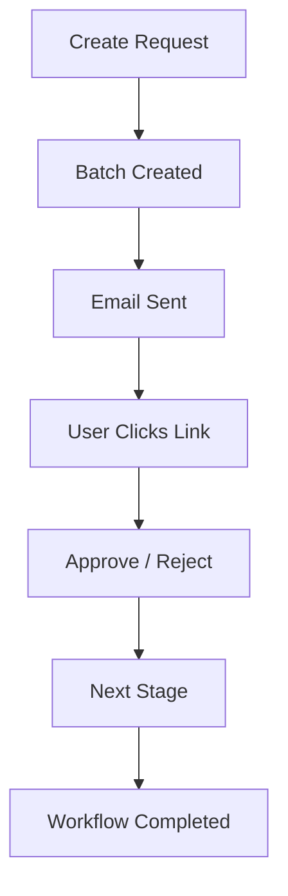
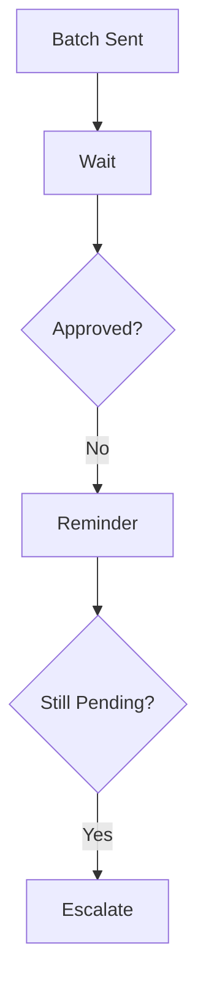
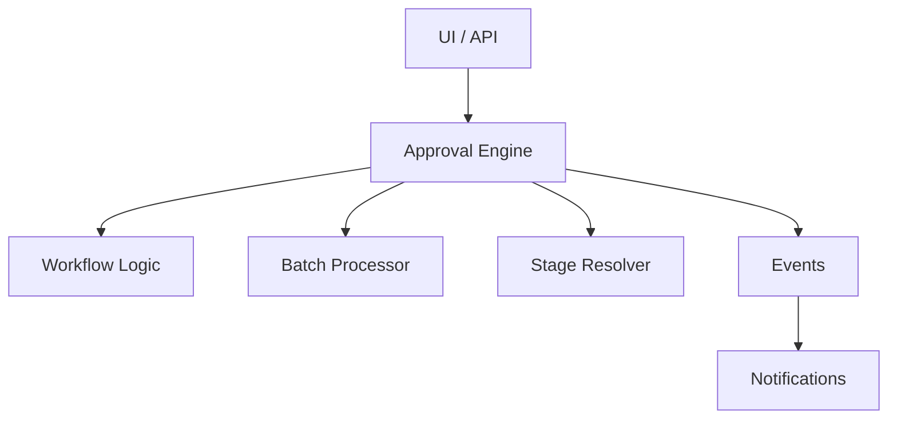

# Laravel Approval Engine

[](https://laravel.com/)
[](https://www.php.net/)
[](LICENSE)
[](https://github.com/apurba-labs/laravel-approval-engine/stargazers)

### Stop Email Spam. Start Smart Approvals.
A modular, batch-based, multi-stage approval workflow engine for Laravel.
Designed for **real-world enterprise workflows** -- it handles **high-volume  enterprise requests** into actionable notification batches with email-based approvals and fully configurable stages..

## Demo (Real Workflow)

👉 Create Request → Batch → Approval → Timeline → Done

🚧 Demo GIF coming soon (actively working on UI)

Meanwhile, you can test locally:

```bash
php artisan approval:demo

```
---
## 🏗️ Active Development (UI Layer)
We are currently building the frontend components to provide a full "Plug & Play" experience. 

| Component | Status | Description |
| :--- | :--- | :--- |
| 🧾 **Workflow List** | 👷 In Progress | A management dashboard for all active batches. |
| 🧠 **Approval Timeline** | 🎨 Designing | A visual history of who approved/rejected and when. |
| 🔐 **IAM Dashboard** | ⚙️ Backend Ready | Powered by `laravel-iam` for scoped RBAC management. |

👉 **Note:** Screenshots and a full Demo GIF will be added in upcoming releases as the UI components are finalized.
---

## Why This Package? Solving "Approval Fatigue"
In most enterprise systems:
- **Email Spam:** 100 purchase requests = 100 separate emails to the Manager. 😓
- **Hardcoded Logic:** Approval steps are buried inside Controllers or Models.
- **No Escalation:** No built-in way to remind pending approvers or escalate.

**Laravel Approval Engine** solves this by separating the **Workflow Logic** from your **Business Models** and grouping requests into smart batches.

---

### Key Features

- **📦 Smart Batching:** Group 50 records into **1 single email/notification**.
- **⛓️ Multi-Stage Workflows:** Define paths like `Requisition -> HOS -> COO -> Finance`.
- **🔗 Token-Based Links:** Approve or Reject directly from an email without logging in.
- **🧩 Zero-Coupling:** Works with any Eloquent model without altering your schema.
- **⏳ Escalation Engine:** (v2.0) Automatic reminders and "Escalate to Higher Role" logic.
- **🚀 IAM Ready:** Integrates with [Laravel IAM](https://github.com/apurba-labs/laravel-iam) for scoped authority.

---

## Example Use Cases

- 🧾 Requisition Approval (HOS → COO)  
- 💰 Invoice Approval (Manager → Finance → CFO)  
- 🛒 Purchase Workflow  
- 🧑‍💼 Leave Approval System  

---

## How It Works



---
## ⏱ Escalation & Reminder Flow


---

## Quick Start (2 Minutes)

```bash
git clone https://github.com/apurba-labs/laravel-approval-engine

cd laravel-approval-engine/example/laravel-demo

composer install
cp .env.example .env
php artisan key:generate

php artisan migrate
php artisan approval:demo
```
👉 Output:

```pgsql

✔ Sample data created
✔ Batch generated
✔ Approval link generated

```
## Demo Screenshot


---

## Installation


```bash
composer require apurba-labs/laravel-approval-engine

```

---

## Setup

```bash
php artisan vendor:publish --tag=approval-config
php artisan migrate
php artisan db:seed --class="ApurbaLabs\ApprovalEngine\Database\Seeders\WorkflowDatabaseSeeder"

```

---

## Create Workflow Module

```bash
php artisan make:workflow-module Requisition
```
### Example: Define Module

```php
class RequisitionModule extends BaseWorkflowModule
{
    public function model(): string
    {
        return \App\Models\Requisition::class;
    }

    /**
     * Validate records before they enter a batch.
     * Useful for checking data integrity or custom business rules.
     */
    public function validate(array $data): void
    {
        // Default: No validation required
        validator($data, [
            'total_amount' => 'required|numeric|min:1',
            'user_id' => 'required|exists:users,id',
        ])->validate();
    }

    public function approvedColumn(): string
    {
        return 'approved_at';
    }
    
    /**
     * Default status column name. 
     * Override this in the child class if it differs.
     */
    public function statusColumn(): string
    {
        return 'status';
    }

    /**
     * Default priorities: check for 'user', then 'creator'.
     * Individual modules can override this.
     */
    public function ownerRelations(): array
    {
        return ['user', 'creator'];
    }

    /**
     * Allow developers to add extra relations (like 'items' or 'department').
     */
    protected function customRelations(): array
    {
        return [];
    }


    public function selectColumns(): array
    {
         return [
            'id',
            'user_id',
            'reference_id',
            'stage',
            'stage_status',
            'status',
            'approved_at',
        ];
    }

    public function displayColumns(): array
    {
        return [
            'reference_id' => 'Reference',
            'user.name' => 'Requested By',
        ];
    }
    public function relationModels(): array
    {
        return [
            'user' => \ApurbaLabs\ApprovalEngine\Tests\Support\Models\User::class,
            //'admin' => \App\Models\Admin::class,
        ];
    }
}


```

---
## RBAC Integration (laravel-iam) 

```md
This engine works seamlessly with:
👉 Role-based access control (RBAC)
👉 Permission-based approval resolution
```
Example:
```php

$user->can('approval.approve');

```
---
## Architecture

---
## Commands

```
php artisan approval:send-batch
php artisan approval:status
```
---
## Roadmap

### v1.4 (Current 🚧)

✅ Workflow engine \
✅ IAM integration \
🔜 Filament UI \
🔜 Rule Builder (no-code)

### v2.0

🔜 Slack / Teams integration \
🔜 Advanced analytics

### v3.0 (SaaS)
🔜 Multi-tenant system \
🔜 API platform
🔜 Dashboard (Next.js)

---

## ⭐ Support the Project

If this package has helped you streamline your enterprise workflows, please consider supporting it:

*   **Star the Repo** – It helps other developers find this tool.
*   **Share with your Team** – Spread the word to your fellow Laravel developers.
*   **Contribute** – Submit a PR or open an issue to help make it even better.

---

### 🚀 Need a Custom Approval System?

Need a hand setting up **Multi-level approvals**, **RBAC**, or a **SaaS-ready architecture**? I’m available for hire:

📩 **[Connect on LinkedIn](https://www.linkedin.com/in/apurba-narayan-singh/)**  
📧 **[Email Me: apurbansinghdev@gmail.com](mailto:apurbansinghdev@gmail.com)**


## 🤝 Contributing

PRs are welcome.

---
## License

MIT License
